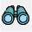
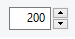
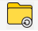
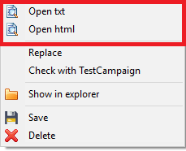
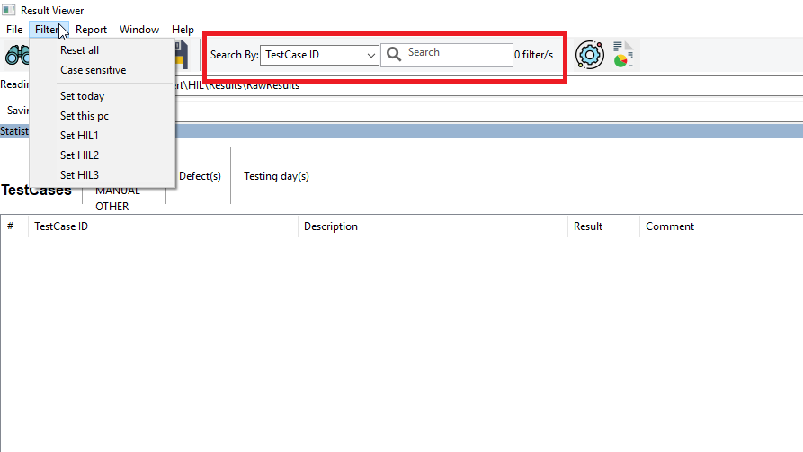

=====
Usage
=====

Read
====

Read TestResult from the Reading folder is possible via the following menu/icon:

Menu: File/Read

----

Because of speed performance, only N last generated files will be readed. is possible to set this value from
the number input widget

----

The reading folder can be reset to the default folder using the following menu/icon:
Menu File/Reset folder

View
====

To view the TXT or HTML version of TestResult/s selected. Right click on the list of result, click the
preferred option from the context menu.

From the context menu is also possible to:

- Replace in one or multiple TestResult, one specific field with a choosen value.
- Open the folder of selected TestResult.
- Save selected TestResult.
- Delete selected TestResult.

Filtering
=========

Is possible to filter the visualized result using the toolbar filter widget.
Select the column you want to filter, type the string to filter and click [ENTER] to refresh the list.

Reset filter is possible via menu **Filter/Reset all**.

Is possible to check/uncheck the case sensitive via menu **Filter/Case sensitive**.

From the Filter menu is possible to set quick filters.

Save
====

To save the selected TestResult to the Saving folder use the following command:

Menu: File/Save
Context menu: Save

If TestResult is linked with one or more MDF file/s, the MDF/s is/are saved as well in the saving folder.

Report
======
